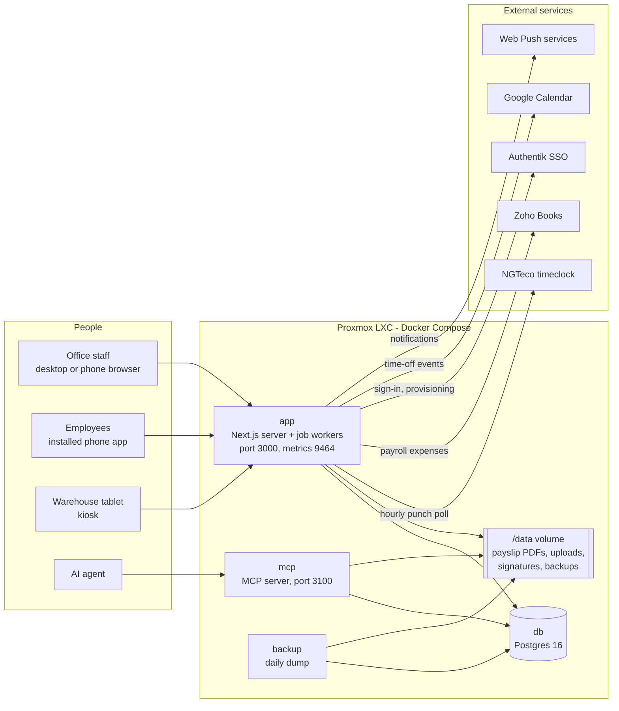
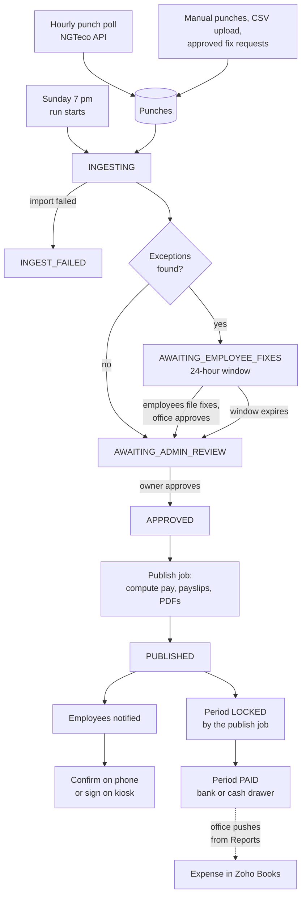
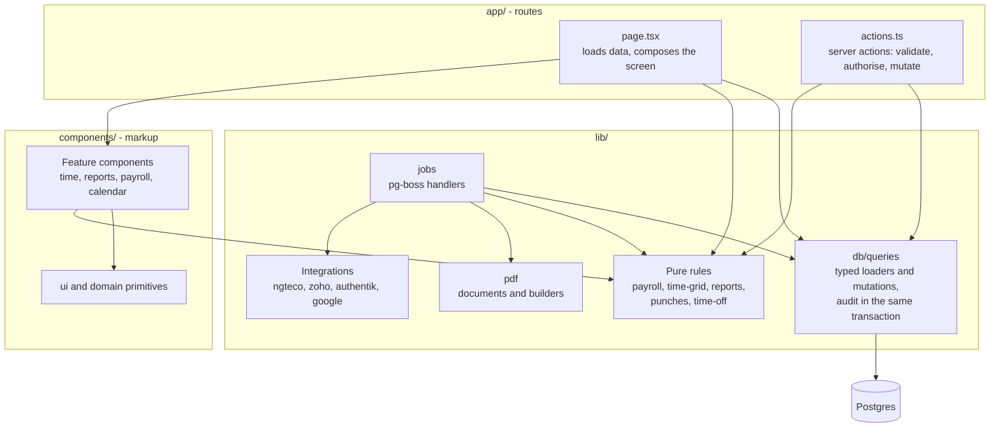
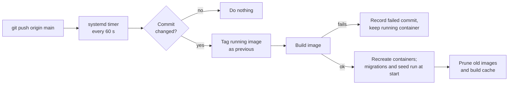

# Architecture

How the payroll platform is put together: what runs where, how a week of payroll flows through it, and how the code is organised. For the change-by-change history see [`CLAUDE.md`](../CLAUDE.md); for the original design contract see [`spec.md`](spec.md).

## 1. System overview

Everything runs in one Proxmox LXC under Docker Compose. One container image serves both the web app and the MCP server.

| Service | Role |
|---|---|
| `app` | The Next.js server. It also starts the `pg-boss` job workers in the same process, so there is exactly one node doing background work. |
| `mcp` | The MCP server, run from the same image. It reads and writes through the same query layer as the app. |
| `db` | Postgres 16. It also holds the job queue (`pg-boss` tables); there is no Redis. |
| `backup` | Dumps the database once a day into the data volume and prunes old dumps. |
| `cadvisor` | Container metrics for monitoring. |

TLS is terminated upstream by a reverse proxy; the stack itself serves plain HTTP.

**Three ways to sign in, kept separate on purpose:**

- **Office staff and employees** use Auth.js sessions (email and password, or Authentik single sign-on). Employee sessions are long-lived so the phone app stays signed in; staff sessions are capped at 30 days.
- **The kiosk** does not use Auth.js. A clock ID and PIN produce a short-lived signed cookie scoped to `/kiosk`.
- **Payday signing** on the kiosk uses a one-time office code and its own scoped cookie, so it can never be swapped for a kiosk session.

**Secrets.** Third-party credentials (NGTeco, Zoho, Google) are sealed with AES-GCM by `lib/crypto/vault.ts` before they are stored. Environment secrets live in `/etc/payroll/.env` on the server and are never committed.

## 2. Background jobs

All scheduling is `pg-boss` inside the `app` process.

| Job | When | What it does |
|---|---|---|
| `ngteco.punch.poll` | hourly | Pulls new punches from NGTeco over its REST API and pairs them into shifts; falls back to the browser scraper if the API errors |
| `period.rollover` | daily, 00:30 | Opens the next pay period when one ends |
| `payroll.run.tick` | Sunday 7 pm (configurable) | Starts the weekly payroll run |
| `payroll.run.detect-exceptions` | during a run | Finds missing or suspicious punches |
| `payroll.run.fix-window-expire` | 24 hours after detection | Closes the employee fix window |
| `payroll.run.publish` | on approval | Computes pay, writes payslips, renders PDFs, notifies employees |
| `ngteco.import` | at the start of each payroll run, and on demand | The full import for a run, through the browser scraper |
| `ngteco.chrome-reaper` | every 5 minutes | Kills orphaned headless browsers |
| `authentik.reconcile` | nightly | Provisions any single sign-on accounts that were missed |

Because there is a single node, **a deploy is a job interruption**: the container restarts and anything in flight is cut off. The app closes interrupted polls at start-up, but deploys should still avoid the top of the hour.

## 3. The weekly payroll run

Points that are easy to get wrong:

- **Pay follows the period, not the date.** Payroll math keys off the period a punch is attached to. A shift reported after its week was paid is recorded with its true timestamps but attached to the current period, so the money flows into the next run. This is "back pay".
- **Schedules never mix.** A run pays only employees whose pay schedule exactly matches the run's. An employee with no schedule is on no scheduled run until one is assigned.
- **Stored versus live figures.** Once a run is published, screens show the stored payslip figures. Before that they show live figures computed from punches.
- **Zero-pay payslips.** The publish job writes a payslip row for every hourly employee on the schedule, including people who did not work. Those rows are bookkeeping only and are hidden from employees and from sign-off.
- **A payslip signature is written once** and never overwritten.
- **Zoho is a manual push.** The office sends a run's expense to Zoho Books from the Reports page; nothing is sent automatically.

## 4. How the code is layered

The rule: **pages fetch data, call `lib/`, and render components. Rules and maths live in `lib/` with tests.**

- **Pure rules** take plain data and return plain data: who belongs on a period, how a time-grid cell is classified, how pay is computed and rounded, how report rows group and total. They have no database access, which is what makes them testable.
- **Loaders** such as `loadPeriodReview()` and `loadCalendarView()` do a page's data loading in one place and return one typed object; section components take that object and use what they need.
- **Server actions are the API.** Each validates its input with Zod, checks authorisation itself, and writes an audit row with every mutation.
- **PDF documents** under `lib/pdf/*.tsx` are bundled separately from the web app by `esbuild` at image build time, so they must not import app-only modules.

## 5. How changes are verified

| Layer | Tool | Covers |
|---|---|---|
| Rules | Vitest unit tests | Pay computation, period selection, grid states, report maths, formatters |
| Rendered output | Golden check | 32 server-rendered pages and 4 PDFs compared byte for byte against pinned output, on a scratch database with a frozen clock |
| Container | `deploy/verify-image.sh` | The live image: size, Node version, health, runtime modules, image processing, headless browser, the browser reaper, scripts, MCP, metrics, logs |
| Routes | `scripts/smoke.sh` | Every route answers |
| Deploy unit | `deploy/test/*.sh` | The deploy script's behaviour against a throwaway git remote |

The golden check pins server-rendered output only. Client-side interaction (filters, menus, form state) is not pinned, so changes there need a browser check.

## 6. Build and deploy

The image is built in stages: install dependencies, build the Next.js standalone bundle and the MCP bundle, then assemble a slim Node 24 runtime with production modules and a headless Chromium for the scraper fallback. Rollback is retagging `previous` as `latest`; the steps are in the [runbook](runbook.md).
